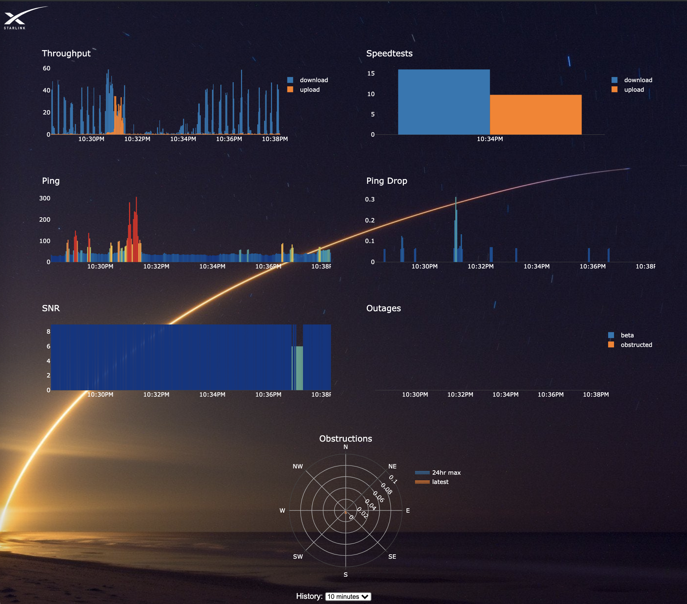

# starlink-monitor

Basic [monitoring webapp](http://localhost:3000) for Starlink

Inspired by [ChuckTSI's work](https://github.com/ChuckTSI/BetterThanNothingWebInterface)

Background image credit: [u/johnkphotos](https://www.reddit.com/r/space/comments/4i3t6t/long_exposure_photograph_i_took_of_this_mornings/)

Installation:

```
docker-compose build && docker-compose up -d
```

View at [http://localhost:3000](http://localhost:3000)


