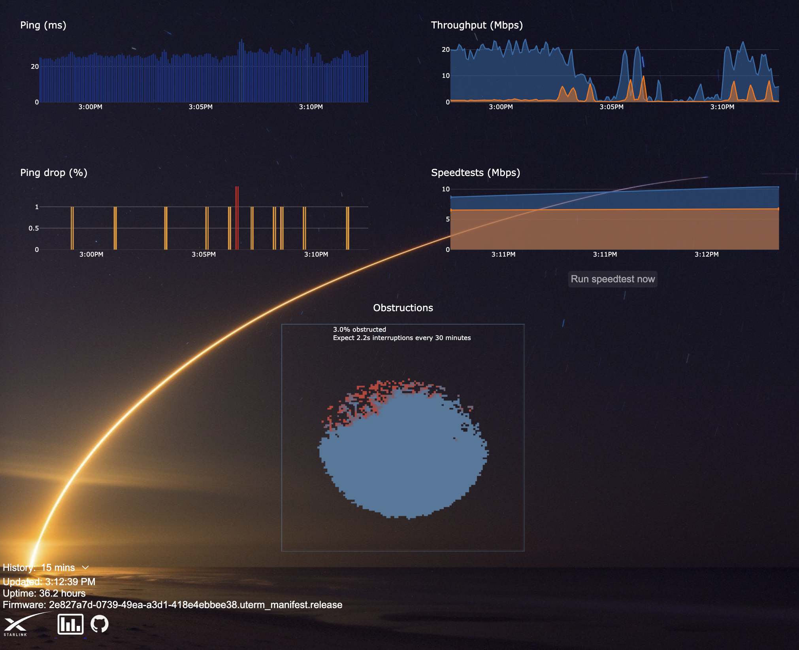

# starlink-monitor

Basic [monitoring webapp](http://localhost:3000) for [Starlink](https://starlink.com)

Inspired by [ChuckTSI's work](https://github.com/ChuckTSI/BetterThanNothingWebInterface)

Background image credit: [u/johnkphotos](https://www.reddit.com/r/space/comments/4i3t6t/long_exposure_photograph_i_took_of_this_mornings/)

## Installation

```
docker-compose build && docker-compose up -d
```

View at [http://localhost:3000](http://localhost:3000)

## Environment variables

| env                             | description                              | default              |
| ------------------------------- | ---------------------------------------- | -------------------- |
| `STARLINK_URI`                  | URI for starlink router                  | `192.168.100.1:9200` |
| `STARLINK_REFRESH_SECS`         | seconds between dishy status checks      | `1`                  |
| `STARLINK_HISTORY_REFRESH_SECS` | seconds between dishy 12hr history pulls | `30`                 |
| `SPEEDTEST_REFRESH_MINS`        | minutes between speedtests               | `30`                 |
| `BUFFER_SIZE_HOURS`             | number of hours of history (in memory!)  | `72`                 |


## Screenshot

